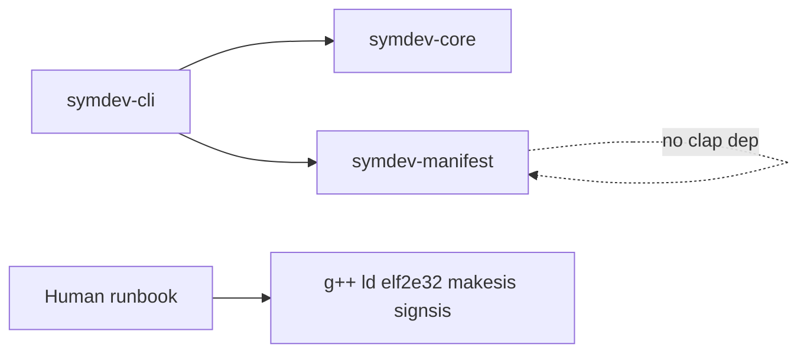

# §17 M0 De-risk Implementation Plan

> **For agentic workers:** REQUIRED SUB-SKILL: **superpowers:subagent-driven-development** (user chose option 1). Fresh implementer subagent per task, spec+quality review after each task, whole-branch review at the end. Do not pause for human check-in between tasks. Steps use checkbox (`- [ ]`) syntax for tracking.

**Goal:** Deliver the spec’s §17 accept bar: research bootstrap, M0 runbook, Dockerfile, EKA2L1 appendix, `.mmp`/`bld.inf` parser spec, experiment backlog, and a compiling workspace with `symdev-cli` / `symdev-core` / `symdev-manifest` — no compiler driver.

**Architecture:** Documentation captures Verified vs Unknown toolchain steps for a human on this Linux host. The Rust side only locks names: empty backend traits, real `symdev.toml` validation, and four clap commands that refuse to run. Wave 0 GCC ELF pipeline stays in the runbook, not in the CLI.

**Tech Stack:** Rust 1.75, edition 2021, workspace resolver `"2"`, `clap` (derive), `serde` + `toml`, `thiserror`. Test deps: `assert_cmd`, `tempfile`, `predicates` (optional). No `tokio`.

**Canonical plan file after approval:** [docs/superpowers/plans/2026-09-16-symdev-m0-s17.md](docs/superpowers/plans/2026-09-16-symdev-m0-s17.md)

**Spec:** [docs/superpowers/specs/2026-09-16-symdev-m0-north-star-design.md](docs/superpowers/specs/2026-09-16-symdev-m0-north-star-design.md)

**Execution (locked):** Subagent-Driven. Before Task 1, copy this plan into `docs/superpowers/plans/2026-09-16-symdev-m0-s17.md`. Then dispatch a fresh implementer per task (1→11), review after each, finish with a whole-branch review. No inline execution in the parent session except coordination, answering implementer questions, and reviews.

## Global Constraints

- `rust-version = "1.75"`, edition `2021`, workspace `resolver = "2"`.
- Create only `crates/symdev-cli`, `crates/symdev-core`, `crates/symdev-manifest`. No other crates, no `platforms/`, no `golden/`, no `fixtures/`.
- clap: only `new`, `build`, `package`, `deploy`. `--help` must not list `doctor`, `test`, `run`, `debug`, `sdk`, `toolchain`, `emulator`, `devices`.
- CLI never spawns GCC, `ld`, `elf2e32`, `makesis`, `signsis`, `makekeys`, or EKA2L1.
- Do not write a compiler/`bld.inf`/`.mmp` driver. This spec does not authorize M1.
- Never commit, COPY, curl, or scrape SDK, WTK, ROM, `.cer`, `.key`.
- Do not invent argv, clone URLs, or install steps. Cite primary sources; label gaps `UNKNOWN — requires experiment`.
- First pipeline (docs only): `arm-none-symbianelf-g++` → `arm-none-symbianelf-ld` → `elf2e32` → `makesis` → `signsis`. Bypass `abld`/`makmake`. Never `-fPIC`/`-fPIE`.
- User-grantable caps only: `LocalServices`, `NetworkServices`, `ReadUserData`, `WriteUserData`, `UserEnvironment`, `Location`. Privileged caps: hard error.
- `target.device` only `nokia-e52`; `language.name` only `cpp`; `signing.mode` only `self-signed`.
- No `LICENSE` file. No Windows VM. No Java ME / UIQ / S40 sections.
- Dockerfile after the runbook exists and is internally consistent (Unknowns labeled). Base `ubuntu:24.04`. SDK bind-mounted, not in the image. No EKA2L1 in the image.
- TDD for all Rust: failing test first, watch it fail, then minimal code.
- Frequent commits after each task’s green tests / complete docs.

## File structure

- `[.gitignore](.gitignore)` — `/target`, `*.sis`, `*.sisx`, `*.cer`, `*.key`, `/sdk/`, `/rom/`, `/third_party/sdk/`, `/third_party/rom/`. Do not ignore `/**/EPOC32/` globally.
- `[Cargo.toml](Cargo.toml)` — virtual workspace, three members.
- `[crates/symdev-core/src/error.rs](crates/symdev-core/src/error.rs)` — `Error`, `Result`.
- `[crates/symdev-core/src/types.rs](crates/symdev-core/src/types.rs)` — `PathStyle`, `RemotePath`, `Output`, `Project`, `Artifact`, `Package`.
- `[crates/symdev-core/src/traits.rs](crates/symdev-core/src/traits.rs)` — twelve traits as in spec §6.
- `[crates/symdev-core/src/lib.rs](crates/symdev-core/src/lib.rs)` — re-exports.
- `[crates/symdev-manifest/src/error.rs](crates/symdev-manifest/src/error.rs)` — manifest errors.
- `[crates/symdev-manifest/src/schema.rs](crates/symdev-manifest/src/schema.rs)` — serde structs, `deny_unknown_fields`.
- `[crates/symdev-manifest/src/validate.rs](crates/symdev-manifest/src/validate.rs)` — UID/cap/platform/name rules.
- `[crates/symdev-manifest/src/lib.rs](crates/symdev-manifest/src/lib.rs)` — `parse`, `load`.
- `[crates/symdev-cli/src/cli.rs](crates/symdev-cli/src/cli.rs)` — clap.
- `[crates/symdev-cli/src/main.rs](crates/symdev-cli/src/main.rs)` — dispatch, exit codes.
- `[crates/symdev-cli/tests/cli.rs](crates/symdev-cli/tests/cli.rs)` — binary integration tests.
- `[docs/research/pipeline-and-tools.md](docs/research/pipeline-and-tools.md)`
- `[docs/research/uids-capabilities-signing.md](docs/research/uids-capabilities-signing.md)`
- `[docs/research/licensing.md](docs/research/licensing.md)`
- `[docs/research/m0-bare-metal-runbook.md](docs/research/m0-bare-metal-runbook.md)`
- `[docs/research/eka2l1.md](docs/research/eka2l1.md)`
- `[docs/research/mmp-bld-inf-parser.md](docs/research/mmp-bld-inf-parser.md)`
- `[docs/research/experiment-backlog.md](docs/research/experiment-backlog.md)`
- `[docker/Dockerfile](docker/Dockerfile)`
- Do not create `golden/`, `fixtures/`, extra crates.




---

### Task 1: Research bootstrap notes

**Files:**

- Create: `docs/research/pipeline-and-tools.md`
- Create: `docs/research/uids-capabilities-signing.md`
- Create: `docs/research/licensing.md`

**Interfaces:** none (docs only).

- [ ] **Step 1: Write `pipeline-and-tools.md`**

Promote spec §4.2 verbatim as **Verified**. Cite primary sources found at plan time (do not invent further commands):

- GCC project: [https://github.com/fedor4ever/GCC4Symbian](https://github.com/fedor4ever/GCC4Symbian) (`build-toolchain.sh`; README warns incompatible with abld).
- Prebuilt GCC 14.2.0 + binutils 2.29.1: [https://sourceforge.net/projects/gcce4symbian/files/GCC-14.2.0_BINUTILS-2.29.1/](https://sourceforge.net/projects/gcce4symbian/files/GCC-14.2.0_BINUTILS-2.29.1/)
- Blog: [https://fedor4ever.wordpress.com/2024/09/22/gcc-14-1-0-for-symbian-out/](https://fedor4ever.wordpress.com/2024/09/22/gcc-14-1-0-for-symbian-out/)
- `elf2e32_next` (tested S60_3rd_FP2_SDK_v1.1): [https://github.com/fedor4ever/elf2e32_next](https://github.com/fedor4ever/elf2e32_next)
- Older C++14 port: [https://github.com/fedor4ever/elf2e32](https://github.com/fedor4ever/elf2e32)

Mark as **Unknown / Needs experiment**: Ubuntu 24.04 host package list; exact clone commit; whether to use source vs SourceForge tarball; Wine vs native `makesis`/`signsis`/`makekeys`; full compile/link argv (crt, `-L`, `-soname`). State no `darwin`* GCC branch (Verified per research prompt). Never `-fPIC`/`-fPIE`.

- [ ] **Step 2: Write `uids-capabilities-signing.md`**

Copy spec §4.5: six user-grantable caps, UID ranges, platform UID `0x102752AE`, self-sign only, `makekeys -expdays 3650` for 9.2+ tools. Label `makekeys -dname` fields **Unknown**.

- [ ] **Step 3: Write `licensing.md`**

Never bundle SDK/WTK/ROM. EKA2L1 GPL-3.0 process-only. Original `elf2e32` EPL-1.0; `rcomp`/etc. Example Source License — future ports in separate modules. Repo license undecided; no `LICENSE` this cycle.

- [ ] **Step 4: Commit**

```bash
git add docs/research/pipeline-and-tools.md docs/research/uids-capabilities-signing.md docs/research/licensing.md
git commit -m "$(cat <<'EOF'
Record Verified toolchain facts and licensing constraints for M0.

EOF
)"
```

---

### Task 2: M0 bare-metal runbook

**Files:**

- Create: `docs/research/m0-bare-metal-runbook.md`

- [ ] **Step 1: Write the runbook** with the twelve chapters from spec §10.2.

Preconditions: x86_64 Linux; Ubuntu 24.04 preferred; if this host differs, record distro and treat Docker Ubuntu as fallback. Env only: `EPOCROOT`, `SYMDEV_ROM`, `SYMDEV_EKA2L1`. Never curl SDK/ROM.

Each chapter: procedure + Verified fragments from spec §4.2 / §10.2 + `UNKNOWN — requires experiment` for gaps. Include the Verified `makekeys`/`makesis`/`signsis` block. `.pkg` must mention platform UID `0x102752AE` and `!:\sys\bin\`. End by printing the `.sisx` path. EKA2L1 chapter: skip if env vars unset; details live in `eka2l1.md`. E52 chapter: Software installation = All, Online certificate check = Off; no gnokii/gammu; informational until hardware.

Hello sources: do not invent a full app if not Verified; mark experiment. Do not claim a chapter complete if the tool was not run.

- [ ] **Step 2: Commit**

```bash
git add docs/research/m0-bare-metal-runbook.md
git commit -m "$(cat <<'EOF'
Add the bare-metal M0 runbook with Unknowns labeled.

EOF
)"
```

---

### Task 3: EKA2L1 appendix

**Files:**

- Create: `docs/research/eka2l1.md`

- [ ] **Step 1: Write appendix** per spec §12: user-installed binary (`SYMDEV_EKA2L1`), user ROM (`SYMDEV_ROM`), never vendor source, never invent CLI flags (Unknown), skip if unset, skip does not fail §17, emulator success ≠ E52 supported, headless install/launch is M5.
- [ ] **Step 2: Commit**

```bash
git add docs/research/eka2l1.md
git commit -m "$(cat <<'EOF'
Document EKA2L1 as an optional user-supplied process.

EOF
)"
```

---

### Task 4: `.mmp` / `bld.inf` parser spec

**Files:**

- Create: `docs/research/mmp-bld-inf-parser.md`

- [ ] **Step 1: Write spec** from spec §13. Support/reject lists exact. Fail closed on unknown directives. M1 target: EXE / ARMV5 / UREL / GCCE only. No parser implementation. `#if` unimplemented macros = parse error. `PRJ_TESTMMPFILES` parsed but not built by default. Comment/case-insensitivity: Likely, Needs experiment.
- [ ] **Step 2: Commit**

```bash
git add docs/research/mmp-bld-inf-parser.md
git commit -m "$(cat <<'EOF'
Specify M1 MMP and bld.inf support and reject lists.

EOF
)"
```

---

### Task 5: Experiment backlog

**Files:**

- Create: `docs/research/experiment-backlog.md`

- [ ] **Step 1: Write ordered experiments 1–12** from spec §17, each with: procedure, expected result, decision unblocked, outcome field (`pass` / `fail` / `skip`). State M1 coding remains unauthorized until a later review after a hand-built `.sisx`.
- [ ] **Step 2: Commit**

```bash
git add docs/research/experiment-backlog.md
git commit -m "$(cat <<'EOF'
Add the ordered M0-to-M1 experiment backlog.

EOF
)"
```

---

### Task 6: Workspace, gitignore, core error + types

**Files:**

- Create: `.gitignore`
- Create: `Cargo.toml`
- Create: `crates/symdev-core/Cargo.toml`
- Create: `crates/symdev-core/src/lib.rs`
- Create: `crates/symdev-core/src/error.rs`
- Create: `crates/symdev-core/src/types.rs`
- Create: `crates/symdev-manifest/Cargo.toml` (stub `lib.rs` with empty module so workspace builds — or wait until Task 7; prefer empty `pub fn placeholder()` only if needed for members. Better: add all three crates in this task with `symdev-manifest` and `symdev-cli` as `pub fn _placeholder() {}` that Task 7/8 replace. YAGNI: create core fully; add other members only when they have tests.

**Split:** This task creates workspace + `symdev-core` types only. Add other members in later tasks by editing root `Cargo.toml`.

**Produces:** `symdev_core::Error`, `Result`, `PathStyle`, `RemotePath`, `Output`, `Project`, `Artifact`, `Package`.

- [ ] **Step 1: Write the failing test** in `crates/symdev-core/src/types.rs` (or `lib.rs` tests) — first create a minimal crate so the test file can exist. Order: write test in `crates/symdev-core/src/lib.rs` that will not compile, then add types.

Pragmatic TDD for a greenfield crate:

Create `crates/symdev-core/Cargo.toml` + `src/lib.rs` containing only the test:

```rust
#[test]
fn not_implemented_error_displays_feature_and_milestone() {
    let err = symdev_core::Error::NotImplemented {
        feature: "symdev build",
        milestone: "M1",
    };
    assert_eq!(
        err.to_string(),
        "not implemented: 'symdev build' (unlocks at M1)"
    );
}

#[test]
fn remote_path_debug_and_display() {
    let p = symdev_core::RemotePath::new("/tmp/hello");
    assert!(format!("{p}").contains("/tmp/hello"));
    assert!(format!("{p:?}").contains("/tmp/hello"));
}
```

Root workspace `Cargo.toml`:

```toml
[workspace]
resolver = "2"
members = ["crates/symdev-core"]

[workspace.package]
version = "0.1.0"
edition = "2021"
rust-version = "1.75"
```

`crates/symdev-core/Cargo.toml`:

```toml
[package]
name = "symdev-core"
version.workspace = true
edition.workspace = true
rust-version.workspace = true

[dependencies]
thiserror = "2"
```

- [ ] **Step 2: Run test to verify it fails**

```bash
cargo test -p symdev-core
```

Expected: compile fail (`Error` / `RemotePath` not found).

- [ ] **Step 3: Minimal implementation**

`.gitignore`:

```
/target
*.sis
*.sisx
*.cer
*.key
/sdk/
/rom/
/third_party/sdk/
/third_party/rom/
```

`error.rs`:

```rust
#[derive(Debug, thiserror::Error)]
pub enum Error {
    #[error("not implemented: '{feature}' (unlocks at {milestone})")]
    NotImplemented {
        feature: &'static str,
        milestone: &'static str,
    },
    #[error("{0}")]
    Other(String),
}

pub type Result<T> = std::result::Result<T, Error>;
```

`types.rs`:

```rust
use std::path::PathBuf;

#[derive(Debug, Clone, Copy, PartialEq, Eq)]
pub enum PathStyle {
    Posix,
    Windows,
}

#[derive(Debug, Clone, PartialEq, Eq)]
pub struct RemotePath(String);

impl RemotePath {
    pub fn new(s: impl Into<String>) -> Self {
        Self(s.into())
    }
}

impl std::fmt::Display for RemotePath {
    fn fmt(&self, f: &mut std::fmt::Formatter<'_>) -> std::fmt::Result {
        self.0.fmt(f)
    }
}

#[derive(Debug, Clone, PartialEq, Eq)]
pub struct Output {
    pub status: i32,
    pub stdout: Vec<u8>,
    pub stderr: Vec<u8>,
}

#[derive(Debug, Clone, PartialEq, Eq)]
pub struct Project {
    pub root: PathBuf,
}

#[derive(Debug, Clone, PartialEq, Eq)]
pub struct Artifact {
    pub path: PathBuf,
}

#[derive(Debug, Clone, PartialEq, Eq)]
pub struct Package {
    pub primary: PathBuf,
    pub companions: Vec<PathBuf>,
}
```

`lib.rs` re-exports `error::*` and `types::*`.

- [ ] **Step 4: Run tests — expected PASS**

```bash
cargo test -p symdev-core
```

- [ ] **Step 5: Commit**

```bash
git add .gitignore Cargo.toml crates/symdev-core
git commit -m "$(cat <<'EOF'
Add the workspace and symdev-core error and path types.

EOF
)"
```

---

### Task 7: Empty backend traits

**Files:**

- Modify: `crates/symdev-core/src/lib.rs`
- Create: `crates/symdev-core/src/traits.rs`

**Consumes:** `Result`, `RemotePath`, `Output`, `Project`, `Artifact`, `Package`, `PathStyle` from Task 6.

**Produces:** the twelve traits in spec §6.

- [ ] **Step 1: Write the failing test**

```rust
#[test]
fn marker_and_signed_traits_exist() {
    fn assert_marker<T: ?Sized>() {}
    assert_marker::<dyn symdev_core::PlatformBackend>();
    assert_marker::<dyn symdev_core::LanguageBackend>();
    assert_marker::<dyn symdev_core::SDKBackend>();
    assert_marker::<dyn symdev_core::ToolchainBackend>();
    assert_marker::<dyn symdev_core::TestBackend>();
    assert_marker::<dyn symdev_core::RuntimeBackend>();
}

struct NoopEnv;
impl symdev_core::ExecutionEnvironment for NoopEnv {
    async fn run(
        &self,
        _cmd: std::process::Command,
        _cwd: &symdev_core::RemotePath,
    ) -> symdev_core::Result<symdev_core::Output> {
        Err(symdev_core::Error::NotImplemented {
            feature: "ExecutionEnvironment::run",
            milestone: "M1",
        })
    }
    async fn push(
        &self,
        _local: &std::path::Path,
        _remote: &symdev_core::RemotePath,
    ) -> symdev_core::Result<()> {
        Ok(())
    }
    async fn pull(
        &self,
        _remote: &symdev_core::RemotePath,
        _local: &std::path::Path,
    ) -> symdev_core::Result<()> {
        Ok(())
    }
    fn path_style(&self) -> symdev_core::PathStyle {
        symdev_core::PathStyle::Posix
    }
}

struct NoopBuild;
impl symdev_core::BuildBackend for NoopBuild {
    fn build(&self, _project: &symdev_core::Project) -> symdev_core::Result<Vec<symdev_core::Artifact>> {
        Ok(Vec::new())
    }
}
```

Also add empty impls in the test for `PackageBackend`, `DeviceTransport`, `EmulatorBackend`, `DebuggerBackend` matching spec method names (`r#continue` for continue).

- [ ] **Step 2: `cargo test -p symdev-core` — expected FAIL (traits missing)**

- [ ] **Step 3: Implement `traits.rs` exactly as spec §6** (async fn in traits, no `async-trait`, no default panic bodies). Re-export from `lib.rs`.

- [ ] **Step 4: `cargo test -p symdev-core` — expected PASS**

- [ ] **Step 5: Commit**

```bash
git commit -m "$(cat <<'EOF'
Lock empty backend trait names in symdev-core.

EOF
)"
```

---

### Task 8: Manifest parse + validate

**Files:**

- Modify: `Cargo.toml` (add member)
- Create: `crates/symdev-manifest/Cargo.toml`
- Create: `crates/symdev-manifest/src/{lib,error,schema,validate}.rs`

**Consumes:** none from core required (manifest must not depend on clap; core dep optional — keep **no** `symdev-core` dep unless sharing Error. Spec: separate `invalid manifest` messages. Use `symdev_manifest::Error`.)

**Produces:** `parse(&str) -> Result<Manifest, Error>`, `load(path) -> Result<Manifest, Error>`.

User-grantable set constant:

```rust
pub const USER_GRANTABLE: &[&str] = &[
    "LocalServices",
    "NetworkServices",
    "ReadUserData",
    "WriteUserData",
    "UserEnvironment",
    "Location",
];
```

`Manifest` fields after validate: `package{name, version: (u32,u32,u32)}`, `target.device` enum/string `nokia-e52`, `platform{family,version,feature_pack}` always filled (`s60`,`3rd`,`fp2` inferred), `language: Cpp`, `toolchain{sdk: Option, compiler: Gcce14|Gcce15 default Gcce14}`, `symbian{uid3: Option<u32>, capabilities: Vec<String>, vendor: String default "symdev"}`, `signing{mode: SelfSigned, cert: Option<PathBuf>, key: Option<PathBuf>}`.

Serde: `#[serde(deny_unknown_fields)]` on every struct. Unknown top-level tables fail.

- [ ] **Step 1: Failing tests** in `crates/symdev-manifest/src/lib.rs` (or `tests/parse.rs`):

Accept:

- Canonical hello TOML from spec §7 (no uid3, empty caps).
- Explicit uid3 `0xA0000001` + one user-grantable cap, no duplicates.
- Omitted `[platform]` infers s60/3rd/fp2.
- Default compiler `gcce-14` when toolchain omitted.

Reject (`Error` display starts with context the CLI will prefix; crate error reason strings used after `invalid manifest:` ):

- `target.device = "nokia-n95"`
- `language.name = "java"`
- uid3 `0x1000007a` (protected, `< 0x80000000`)
- cap `PowerMgmt`
- unknown cap `Foo`
- duplicate `NetworkServices`
- unknown table `[widgets]`
- `signing.mode = "devcert"`
- `package.name = "1bad"`
- `package.version = "1.0"` (not three integers)
- missing `symdev.toml` via `load`

Also reject partial `[platform]` (only `family` set).

- [ ] **Step 2: `cargo test -p symdev-manifest` — expected FAIL** (crate missing / fn missing)

- [ ] **Step 3: Implement parse then validate.** UID: `^0x[0-9A-Fa-f]{8}$`. Name: `^[A-Za-z][A-Za-z0-9_]*$`. Version: three non-negative integers. `toolchain.sdk` if present exactly `s60-3rd-fp2`. `toolchain.compiler` if present `gcce-14` or `gcce-15`. Cert/key: non-empty paths, no filesystem check. `load` maps missing file to reason `no symdev.toml in current directory` when CLI looks in cwd — for `load`, IO not-found should be a distinct variant `MissingFile` so CLI can use that exact reason.

- [ ] **Step 4: Tests PASS**

- [ ] **Step 5: Commit**

```bash
git commit -m "$(cat <<'EOF'
Parse and validate symdev.toml with fail-closed rules.

EOF
)"
```

---

### Task 9: CLI stubs

**Files:**

- Modify: `Cargo.toml` members
- Create: `crates/symdev-cli/Cargo.toml`
- Create: `crates/symdev-cli/src/cli.rs`
- Create: `crates/symdev-cli/src/main.rs`
- Create: `crates/symdev-cli/tests/cli.rs`

**Consumes:** `symdev_core::Error::NotImplemented`; `symdev_manifest::{parse, load, Error}`.

**Produces:** binary `symdev`. Exit 0 help; 2 clap; 1 not-implemented / invalid manifest.

Milestones: `new` → M4; `build` → M1; `package` → M2; `deploy` → M4.

Stderr formats (exact):

```
error: not implemented: 'symdev build' (unlocks at M1)
error: invalid manifest: no symdev.toml in current directory
error: invalid manifest: <reason>
```

- [ ] **Step 1: Write integration tests** (`assert_cmd` + `tempfile`)

```rust
use assert_cmd::Command;
use predicates::prelude::*;

fn bin() -> Command {
    Command::cargo_bin("symdev").unwrap()
}

#[test]
fn help_lists_only_four_commands() {
    let out = bin().arg("--help").assert().success();
    out.stdout(predicate::str::contains("new"));
    out.stdout(predicate::str::contains("build"));
    out.stdout(predicate::str::contains("package"));
    out.stdout(predicate::str::contains("deploy"));
    out.stdout(predicate::str::contains("doctor").not());
    out.stdout(predicate::str::contains("toolchain").not());
}

#[test]
fn doctor_is_unknown_subcommand() {
    bin().arg("doctor").assert().failure().code(2);
}

#[test]
fn new_not_implemented_creates_no_files() {
    let dir = tempfile::tempdir().unwrap();
    bin()
        .current_dir(&dir)
        .args(["new", "hello", "--target", "nokia-e52"])
        .assert()
        .failure()
        .code(1)
        .stderr(predicate::str::contains(
            "error: not implemented: 'symdev new' (unlocks at M4)",
        ));
    assert!(dir.path().read_dir().unwrap().next().is_none());
}

#[test]
fn new_rejects_java() {
    bin()
        .args(["new", "hello", "--target", "nokia-e52", "--lang", "java"])
        .assert()
        .failure()
        .code(2);
}

#[test]
fn build_missing_manifest() {
    let dir = tempfile::tempdir().unwrap();
    bin()
        .current_dir(&dir)
        .arg("build")
        .assert()
        .failure()
        .code(1)
        .stderr(predicate::str::contains(
            "error: invalid manifest: no symdev.toml in current directory",
        ));
}
```

Add tests: valid toml in temp dir → `build`/`package`/`deploy` exit 1 `not implemented` with M1/M2/M4; invalid toml (e.g. `lang` java) → `invalid manifest` not `not implemented`; `new` does not read toml.

clap: `--target` required on `new`, only `nokia-e52`; `--lang` default `cpp`, only `cpp`.

- [ ] **Step 2: `cargo test -p symdev-cli` — expected FAIL** (no binary)

- [ ] **Step 3: Implement clap + main**

`main` flow for `build`/`package`/`deploy`: `load(Path::new("symdev.toml"))`; on err print `error: invalid manifest: {e}` exit 1; on ok print not-implemented exit 1.

Do not create files in `new`.

Cargo.toml binary:

```toml
[[bin]]
name = "symdev"
path = "src/main.rs"
```

Deps: `clap = { version = "4", features = ["derive"] }`, `symdev-core`, `symdev-manifest`. Dev: `assert_cmd`, `tempfile`, `predicates`.

- [ ] **Step 4: `cargo test` and `cargo clippy -D warnings` PASS. `cargo fmt`.**

- [ ] **Step 5: Commit**

```bash
git commit -m "$(cat <<'EOF'
Add the symdev CLI stubs with real manifest checks.

EOF
)"
```

---

### Task 10: Dockerfile

**Files:**

- Create: `docker/Dockerfile`
- Create: `docker/README.md` (bind-mount instructions only — allowed as part of making the image usable; keep short)

**Depends on:** Task 2 runbook believed internally consistent.

- [ ] **Step 1: Write `docker/Dockerfile`** `FROM ubuntu:24.04`. Install/build GCC + elf2e32 + SIS tools **only** using steps that are Verified or copied from cited project docs. Every Unknown runbook step is a **comment**, not a guessed `wget`. No `COPY` of SDK/ROM. No EKA2L1.

Document `docker run` example: bind-mount SDK at `/opt/symbian/sdk`, `EPOCROOT` pointing there (trailing-separator Needs experiment — comment that).

- [ ] **Step 2: Do not `docker build` in CI.** Optional local build only if the implementer has network; failure to build does not fail §17 if comments match Unknowns.

- [ ] **Step 3: Commit**

```bash
git add docker/Dockerfile docker/README.md
git commit -m "$(cat <<'EOF'
Capture the M0 toolchain image without baking in the SDK.

EOF
)"
```

---

### Task 11: Human §17 accept check

- [ ] **Step 1: Confirm files from spec §9 all exist.**
- [ ] **Step 2: `cargo test && cargo fmt --check && cargo clippy --all-targets -- -D warnings`**
- [ ] **Step 3: Confirm `--help` has four commands only; `symdev doctor` is clap-unknown.**
- [ ] **Step 4: Confirm no SDK/ROM/LICENSE in tree.** Do not claim E52 or emulator support.

No extra commit unless something failed and was fixed.

---

## Spec coverage


| Spec §                                              | Task          |
| --------------------------------------------------- | ------------- |
| 9.1 research                                        | 1             |
| 9.2 runbook                                         | 2             |
| 9.3 Docker                                          | 10            |
| 9.4 EKA2L1                                          | 3             |
| 9.5 workspace/gitignore/cli/core/manifest           | 6–9           |
| 9.6 parser spec                                     | 4             |
| 9.7 experiments                                     | 5             |
| 16.2 tests                                          | 6–9           |
| 16.5 human accept                                   | 11            |
| Non-goals / M1 driver / extra clap / Java / LICENSE | not scheduled |


## Out of this plan

M1 driver, extra crates, extra CLI verbs, CI with SDK, network fetch of SDK/ROM, `LICENSE`, Windows VM, claiming device support.