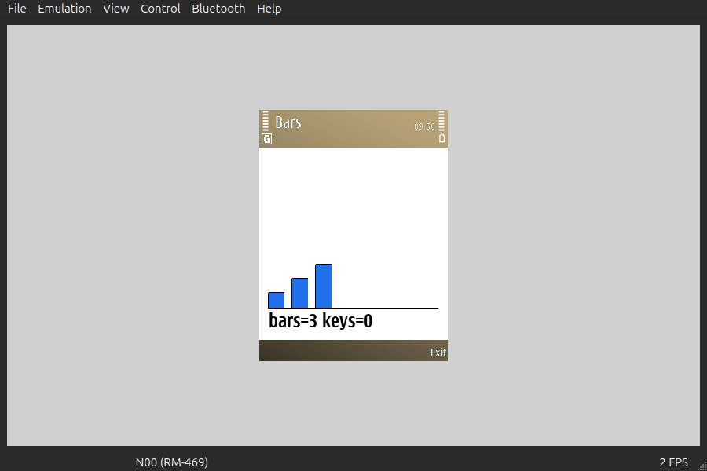
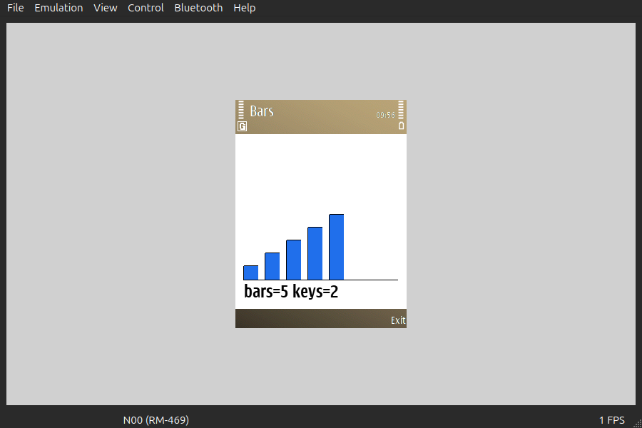

# 86 — an Avkon application whose logic is Rust (2026-09-21)

`uidemo.exe`, 12 715 bytes, is `symbian-rs/examples/ui`. It draws a bar chart from a
`u8` of Rust state and changes it on an arrow key, with no `unsafe`, no `E32Main` and
no `CActiveScheduler` anywhere in the application.




`uidemo-before.png` is the application as it starts: three bars and `bars=3 keys=0`,
every pixel of it painted by the Rust `draw` callback. `uidemo-after.png` is the same
window after `docs/research/acceptance/emukey.py keys <pid> Up Up` — five bars and
`bars=5 keys=2`. **3 767 of the client area's 58 080 pixels changed**, in the bounding
box (63,110)–(152,227). The title pane reads `Bars`, the `short_caption` of the
generated localisable resource.

Also driven and observed in the same session: `Down` four times gives `bars=1 keys=6`
(the clamp holds), a fifth `Down` is *not* counted because the application returns
`EKeyWasNotConsumed` for it, and `Return` (the selection key) resets to
`bars=3 keys=7`.

`symdev test --emulator` reports **3 passed**, exit 0, from the result file the
application's `construct` writes:

```
ok   the framework reached the Rust construct
ok   the view was sized before construct: 240x245
ok   a redraw can be asked for from construct
```

240×245 is the E52 client area between the status pane and the softkeys, measured
rather than assumed.

## What it cost

| | Bytes |
|---|---|
| `uidemo.exe` with the result file | 12 715 |
| the same application without it (drawing and keys alone) | 7 559 |
| experiment 76's mixed C++/Rust UI probe | 107 028 |

The 107 KB never came back: the `-l:euser.dso -l:drtaeabi.dso`-before-the-Rust-archive
ordering of experiment 77 resolves the `mem*` helpers from ROM, so the one
`compiler_builtins` object is never pulled even with a 31 KB C++ object beside the
Rust archive. The 5 156 bytes the report adds are `symbian_std::fs` and `core::fmt`,
not the UI.

Every other example, rebuilt on this branch: `hello` 3 187, `hello-raw` 752, `alloc`
4 474, `shim` 4 474, `files` 10 552, `time` 20 583, `async` 21 659 — unchanged to the
byte — and `atomics` 11 719, `tls` 16 272, `net` 13 380 against `main`'s 11 726,
16 271 and 13 379. Those three were A/B'd in one tree with and without the
`pub use symbian_ui as ui;` line: **`.text` is byte-identical either way** (15 716,
22 016, 17 696), and only the deflate stream of the E32 body moves. That is
experiment 87's own layout wobble — `symbian-std` gaining a dependency changes its
crate disambiguator and LTO lays the same code out differently. So `symbian_std::ui`
costs a console application nothing.

Eleven `NEEDED`: the six of the recorded link line plus `apparc`, `cone`, `eikcore`,
`avkon` and `gdi`. **No `ws32`** — every drawing entry point is a pure virtual of
`CGraphicsContext`, so painting through the gc the framework hands over costs no
window-server import.

Experiment record: `docs/research/experiment-backlog.md` §86. Design and the leave
rule: `docs/research/avkon-rust-spec.md`.
