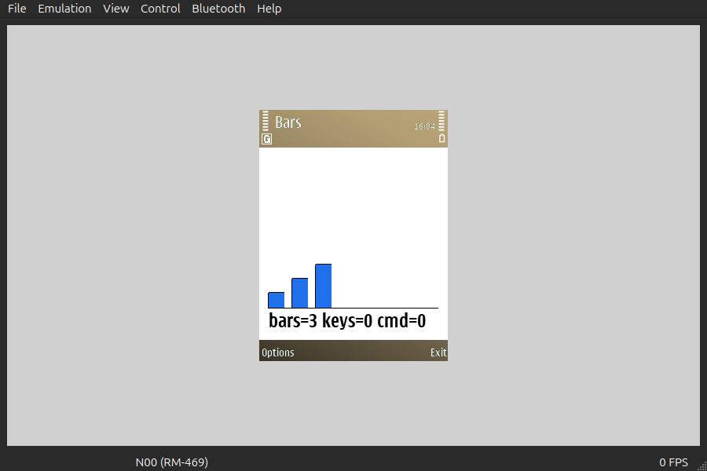
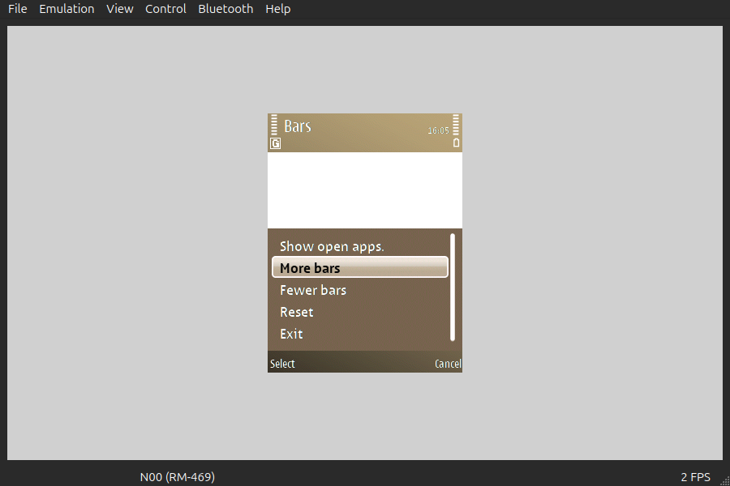
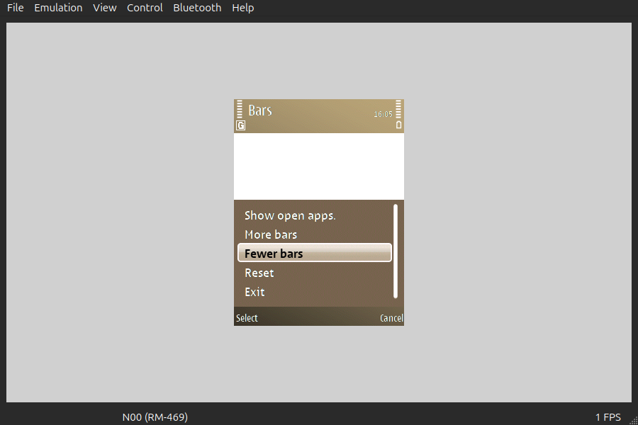
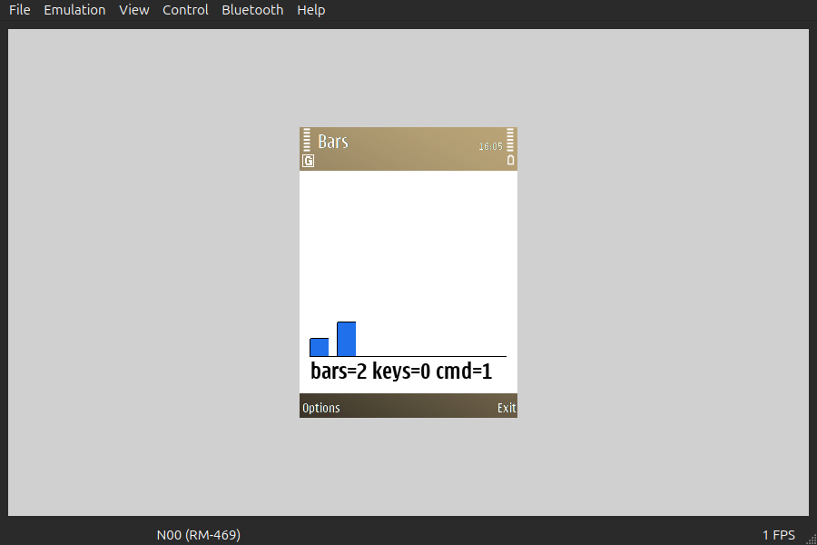

# 91 — the Options menu and working softkeys (2026-09-21)

**Superseded in part by [95](../95-runtime-menu/):** the menu left `symdev.toml` the
same day. The softkey answer below still stands — it is what 95 builds on — but the
`[[ui.menu]]` items, the hashed command ids and `Command::named` are gone.

`uidemo.exe`, 12 844 bytes, is `symbian-rs/examples/ui` grown by an Options menu: four
items declared in `symdev.toml`, matched in Rust by the same four words. `uidemo.rss`
is the resource text symdev generated for it and `uidemo.rsc` (364 bytes) is what the
native `cpp` + `rcomp` pair made of it.

## The softkey answer

**The softkeys were never dead.** With `Emulated.Stdout` turned on in EKA2L1's log
filter (it is `off` in the stock profile, which is why a guest `RDebug::Print` looks
like nothing at all), a probe in `CShimAppUi::HandleWsEventL` and `HandleCommandL`
shows the whole path working for F2 on the *old* build:

```
ws type=3 code=0    scan=a5      EStdKeyDevice1 down, offered to the view
ws type=1 code=f843 scan=a5      EKeyDevice1 — consumed by the CBA, the view never sees it
HandleCommandL 3001              EAknSoftkeyBack
```

`cba = R_AVKON_SOFTKEYS_EXIT` draws `Exit` and sends **3001**. The shim compares
against the symbols `EEikCmdExit` (0x100) and `EAknSoftkeyExit`, which this SDK's
`avkon.hrh` puts at **3009**, so nothing matched and nothing happened. *Why* the ROM's
`R_AVKON_SOFTKEYS_EXIT` sends `EAknSoftkeyBack` was not determined — its `avkon.rsc` is
dictionary-compressed and was not decoded.

The fix is not a new constant to compare against. It is to stop naming a ROM resource:
the application's own `.rss` now declares its own `CBA`, whose right button carries
`EEikCmdExit` and whose left carries `EAknSoftkeyOptions`.

## The evidence






`docs/research/acceptance/emukey.py keys <pid> F1 Down Return F2`, one PID-bound
screenshot after each, diffed over the emulated screen (240×325 at (330,137)):

| Step | What it shows | Pixels changed |
|---|---|---|
| start | `bars=3 keys=0 cmd=0`, softkeys **Options** and **Exit** — both our own labels | — |
| F1 | the Options menu open: Avkon's "Show open apps." and our **More bars / Fewer bars / Reset / Exit** | 36 270 of 78 000, bbox (0,20)–(240,319) |
| Down | the highlight moves from "More bars" to "Fewer bars" | 11 748, bbox (5,179)–(223,233) |
| Return | the menu closes and the drawing is `bars=2 keys=0 cmd=1` | 36 220, bbox (0,145)–(240,319) |
| F2 | **the process is gone** — the emulator exits with the application | — |

`keys=0` throughout is the point that took three sessions to see: a softkey never
reaches `OfferKeyEventL`, because the button group container sits above the view on the
control stack (`ECoeStackPriorityCba` = 60 against the view's 0) and consumes it. The
probe confirmed `HandleCommandL 30226` = `0x7612` = `Command::named("fewer")` for the
`Return` above. `grep -c 'Panic\|KERN-EXEC'` on the log is 0.

Over the client area alone, start → selected is **1 481 of 58 800** pixels, bbox
(63,146)–(212,227): one bar and one line of text.

## One thing that will crash if you undo it

`softkeys = "options-exit"` with no `[[ui.menu]]` item gives, on F1,
`Access violation reading address 0x9C in thread Bars`, with no `HandleCommandL` first —
the framework itself watches for `EAknSoftkeyOptions` and dereferences a menu bar that
was never built. The manifest refuses that combination for this reason.
