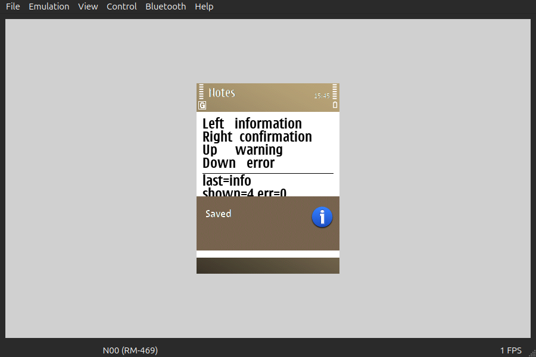
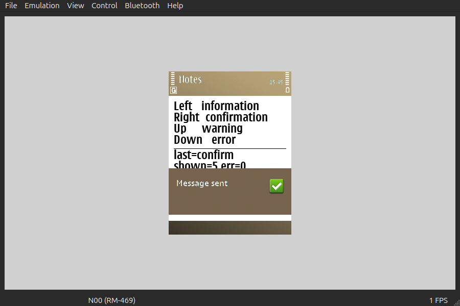
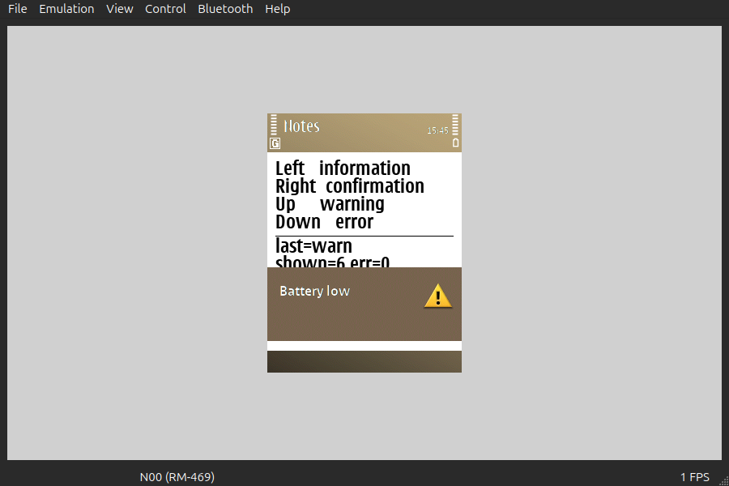
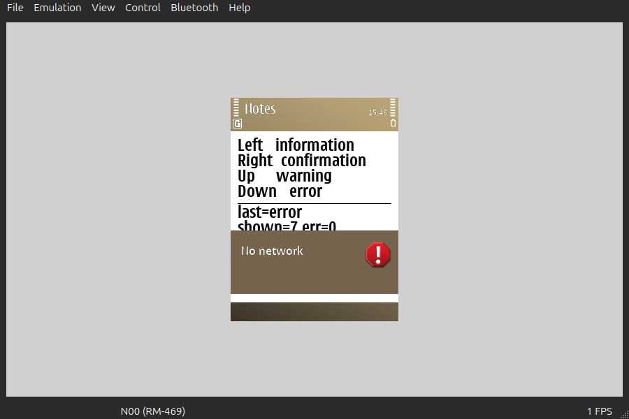

# 92 — the Avkon notes (2026-09-21)

`notes.exe`, 15 298 bytes, is `symbian-rs/examples/notes`: a GUI application that shows
one of the four Avkon notes per arrow key through `symbian_std::ui::note`, so nothing
has to reach for `User::InfoPrint` any more.

| Key | Call | Class |
|---|---|---|
| Left | `note::info("Saved")` | `CAknInformationNote` |
| Right | `note::confirm("Message sent")` | `CAknConfirmationNote` |
| Up | `note::warn("Battery low")` | `CAknWarningNote` |
| Down | `note::error("No network")` | `CAknErrorNote` |






Each `notes-<kind>-after.png` is the window a moment after
`docs/research/acceptance/emukey.py` sent that arrow; the matching `-before.png` is the
same window with no note on it. Over the 240×320 device screen — 76 800 pixels —
the difference is:

| Note | Pixels changed | Bounding box (screen coordinates) |
|---|---|---|
| information | 21 940 | (0,179)–(239,315) |
| confirmation | 22 738 | (0,155)–(239,315) |
| warning | 22 821 | (0,155)–(239,315) |
| error | 22 481 | (0,160)–(239,315) |

The note is a window of its own over the bottom third of the screen and the softkey
bar, which is most of that; the box reaching up to y≈155 is the application's own
`shown=<n>` counter, which the redraw after the call had already incremented. Each
note carries its own S60 icon — blue **i**, green tick, yellow triangle, red
exclamation — none of which the application asked for.

**That counter is also the proof that `ExecuteLD` does not block.** The view repainted
with the new `shown` value *while the note is still on screen*, so the call had already
returned. See §92 of the backlog for the `Instant` figures.

`symdev test --emulator` reports **3 passed**, exit 0, and
`grep -c 'Panic\|KERN-EXEC'` on the emulator log is 0:

```
ok   an information note can be shown from construct: None
ok   ExecuteLD returned without waiting for the note to close: 62500 us
ok   the view was sized before construct: 240x245
```

## What it cost

A/B in one tree, the only change being the four `note::*` calls replaced by a function
that returns `Ok(())`:

| | `.text` | E32 |
|---|---|---|
| `notes.exe` as shipped | 22 996 | 15 298 |
| the same application with the note calls stubbed | 21 940 | 14 651 |
| **all four notes** | **1 056** | **647** |

`shims/s60/symrs_note.o` is 2 796 bytes with 18 undefined symbols, of which five are
the notes' own (`_ZN19CAknInformationNoteC1Ev`, `_ZN20CAknConfirmationNoteC1Ev`,
`_ZN15CAknWarningNoteC1Ev`, `_ZN13CAknErrorNoteC1Ev` and
`_ZN22CAknResourceNoteDialog9ExecuteLDERK7TDesC16`). **No new import library**: all
five come from `avkon.dso`, already on a `[ui]` project's line, and the twelve `NEEDED`
are the eleven of experiment 86 plus `efsrv` for the result file.

`examples/ui` rebuilt on this branch is **12 715 bytes, unchanged**, and differs from
`corpus/86-ui/uidemo.exe` only in the E32 header's timestamp and checksum words. An
application that never shows a note pays nothing for the module existing.

Experiment record: `docs/research/experiment-backlog.md` §92. Design and the leave
rule: `docs/research/avkon-rust-spec.md` §3 and §4.3.
