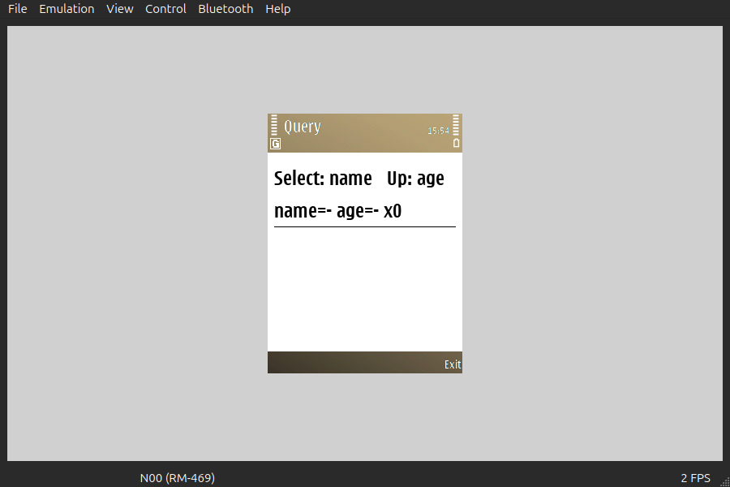
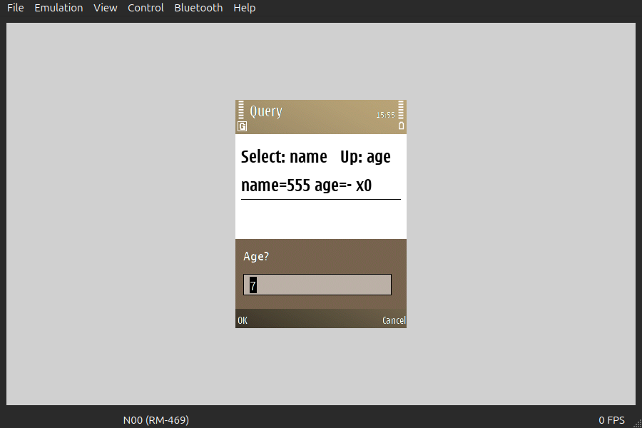
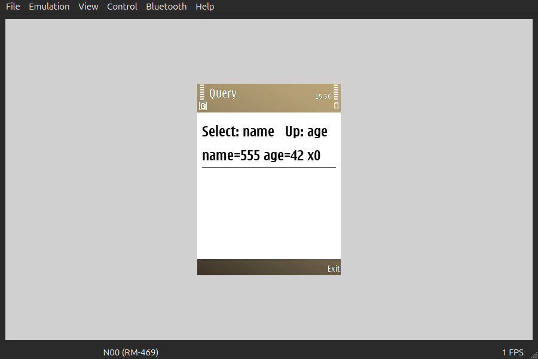

# 93 — Avkon query dialogs from Rust (2026-09-21)

`querydemo.exe`, 20 120 bytes, is `symbian-rs/examples/query`. It asks the user for a
name with `query::text("Name?", 32)` and for a number with `query::number("Age?", 7)`,
and names no Symbian type to do it.






The client area is 240×245, the same 58 800 pixels experiment 86 measured.

| From → to | Keys | Pixels changed | Bounding box |
|---|---|---|---|
| start → text query on screen | `Return` | 23 494 | (0,147)–(240,245) |
| empty field → `555` in it | `5` `5` `5` | 171 | (20,207)–(47,219) |
| start → the answer drawn by Rust | `Return` `5` `5` `5` `Return` | 1 469 | (72,63)–(191,83) |
| answer → number query on screen | `Up` | 23 482 | (0,147)–(240,245) |
| after the text query → after the number query | `Up` `4` `2` `Return` | 635 | (156,63)–(206,80) |
| start → both answers | all of the above | 1 609 | (72,63)–(206,83) |

The 23 000-pixel changes are the dialog covering the bottom 98 rows of the client area;
the 1 469 is the application's own `draw` repainting its label as `name=555`, and the 635
is the same label becoming `age=42`. **The small numbers are the point**: the text the
user typed is inside the Rust `String`, not merely on the screen.

`querydemo-number-query.png` also shows the `initial` this side passed — the field opens
on `7`, selected — so the descriptor traffic is two-way.

## What was confirmed without a softkey

`Return` (`EStdKeyDevice3`, the selection key) both opens a query and confirms it. So the
confirm path is **not** blocked on the softkey slice.

Separately, and against what `docs/research/eka2l1-input.md` reads like: **the softkeys do
work on a query dialog.** `F2` on an open query cancels it — the Rust side gets `Ok(None)`
and the cancel counter advances — and `F1` confirms one. A query's CBA comes from the
ROM's own resource, so the thing that swallows `F1`/`F2` is specific to a CBA built from
the `.rss` symdev generates. That is a discriminator the softkey slice can use.

`Escape` does nothing for a duller reason: it is not bound. The profile at
`~/.local/share/EKA2L1/bindings/default.yml` has 22 binds and they are `F1`–`F4`,
`Return`, the four arrows, `0`–`9`, `*`, `/` and `Backspace`.

## `symdev test --emulator`

**4 passed**, exit 0, from a run nobody drove:

```
ok   the framework reached the Rust construct: 240x245
ok   a query with no room for an answer is refused: Err(KErrArgument (-6))
ok   a query wanting more than the surface allows is refused: Err(KErrArgument (-6))
ok   a prompt longer than the surface allows is refused: Err(KErrOverflow (-9))
```

The driven run above writes **6 passed**, the two extra cases being
`a text query came back: "555"` and `a number query came back: 42`. No case needs a key
press to pass: a test that fails until somebody types is a broken test, not a pending
one, so the dialogs are evidenced by the screenshots and the report covers the entry
path and the guards.

## What it cost

| | Bytes |
|---|---|
| `querydemo.exe` | 20 120 |
| `uidemo.exe` (experiment 86), rebuilt on this branch | 12 715 |
| `hello-raw.exe`, rebuilt on this branch | 752 |

Both of the others are byte-identical to `main`. `symrs_query.cpp` is a new member of
`build/shims/libsymrs.a`, and an archive member nobody references is never pulled, so a
program that asks no question pays nothing — not even `avkon.dso`'s import of
`CAknQueryDialog`. The 7 405 bytes over `uidemo` are `alloc::String`, `core::fmt`'s
`Debug` for the report details, and the three query wrappers.

`nm` on `build/shims/symrs_query.o` shows exactly the three avkon imports the shim cites:

```
U _ZN15CAknQueryDialog4NewLER6TDes16RKNS_5TToneE
U _ZN15CAknQueryDialog4NewLERiRKNS_5TToneE
U _ZN15CAknQueryDialog9ExecuteLDEiRK7TDesC16
```
