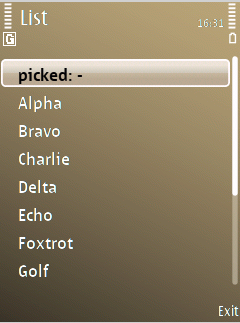
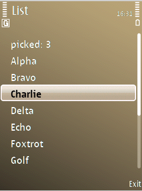
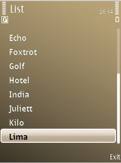

# 94 — the S60 list box from Rust (2026-09-21)

`listdemo.exe`, 14 489 bytes, is `symbian-rs/examples/ui-list`. It shows a
`CAknSingleStyleListBox` of thirteen rows, moves the highlight on the arrows and
rewrites its first row from a Rust callback when an item is chosen — with no `unsafe`,
no Symbian type and no `E32Main` anywhere in the application.

The four frames are the 240x323 guest screen, cropped out of the emulator window.

1. **`listdemo-1-start.png`** — the list as it comes up. Title pane `List` (the
   manifest's `short_caption`), thirteen rows of which nine fit, the highlight on row 0,
   and a scroll bar down the right-hand side. Row 0 reads `picked: -`.
2. **`listdemo-2-down3.png`** — after `emukey.py keys <pid> Down Down Down`. The
   highlight is on `Charlie`, row 3. **12 800 of the client area's 59 280 pixels
   changed**, bounding box (1,14)–(229,125). The application's own `App::key` saw none
   of those three presses: the list is above the view on the control stack and consumed
   every one.
3. **`listdemo-3-selected.png`** — after `emukey.py keys <pid> Return` (the selection
   key, `EKeyDevice3`). Row 0 now reads `picked: 3`. **82 pixels changed**, bounding box
   (77,24)–(85,35) — a 9x12 box holding exactly the one glyph that went from `-` to `3`.
   Those 82 pixels are the whole proof: the only thing that can write them is the Rust
   closure, and it can only write `3` if `MEikListBoxObserver::HandleListBoxEventL`
   handed it `CurrentItemIndex() == 3`.
4. **`listdemo-4-scrolled.png`** — one `Up` from row 0. The list **loop-scrolls** to row
   12 (`Lima`), the visible window becomes `Echo`…`Lima`, and the scroll-bar thumb
   travels from y 57–194 to y 146–283 of the shaft while keeping its 138-pixel height.
   A 138-pixel thumb in a 246-pixel shaft is the visible fraction of the model, so the
   scroll bar is tracking the real list and not decoration.

`grep -c 'Panic\|KERN-EXEC'` on the emulator log is 0 across all of it.

`symdev test --emulator` passes six cases beside the pixels, and they cover what a
screenshot cannot: that `construct` was reached, that the client area is 240x245, that
the model holds all thirteen rows, that row 0 is current to begin with, that the
highlight can be moved from Rust and moved back, and that an index past the end is
refused rather than accepted.

Sizes, all rebuilt in the same tree: `listdemo` 14 489. Unchanged to the byte by this
work: `uidemo` 12 715, `hello` 3 187, `hello-raw` 752, `files` 10 552, `net` 13 379.
`uidemo` also records **no** `eikcoctl`/`eikctl` `DT_NEEDED` — a GUI application with no
list pays nothing for the two libraries the list needs.
